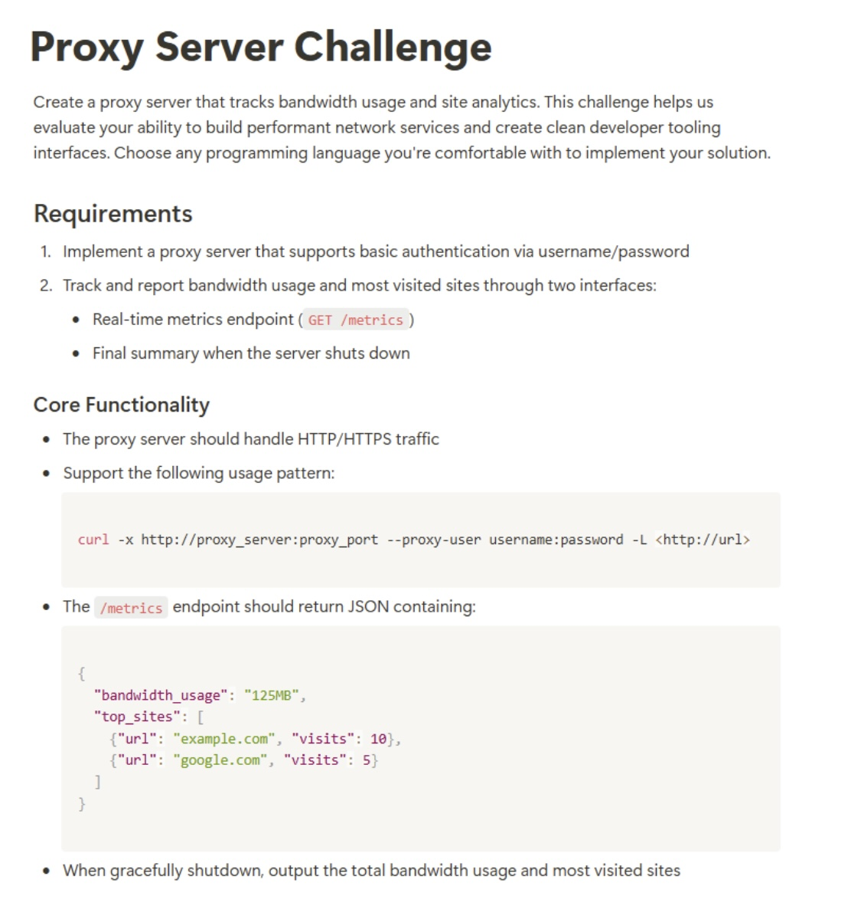

To view a written out version, check [here](challenge.md).

# How it works

[Nginx](https://nginx.org/) is used for the proxy. The service creates a log of
the bandwidth usage and site analytics. This log is then parsed by a Golang
service, which provides the overall metrics.

There were a lot of considerations that went into this implementation. [Squid
Cache](https://www.squid-cache.org/) or [Apache HTTP
Server](https://httpd.apache.org/) may have also been viable choices,
especially as they have more native support for proxying than Nginx does. Though
Nginx is much easier to setup (biased).